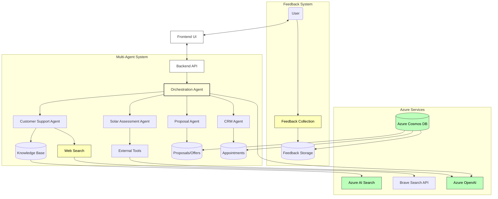

# DemoSolar AI Agent System

This is a prototype AI agent system initially designed for solar panel installation companies but adaptable to various business domains. The system enables customers to interact with different specialized AI agents through a chatbot interface, with the goal of **reducing sales cycles and customer acquisition costs**.

## 💼 Potential Business Impact

Based on prototype testing, systems like this could potentially deliver:
- Reduction in lead qualification time
- Decrease in cost per qualified lead
- Improvement in conversion rates from inquiry to appointment

## 🏗️ System Architecture

The DemoSolar AI Agent System implements a multi-agent architecture that leverages Azure AI services:



The system architecture follows a multi-agent design:

### User Interaction Layer
- **Customer**: Interacts with the system through a web interface
- **Frontend UI**: React-based user interface with chatbot component
- **Backend API**: Express server handling communication between frontend and agents

### Agent System
- **Orchestration Agent**: Central coordinator that routes requests to specialized agents
- **Customer Support Agent**: Handles educational queries using knowledge base and web search
- **Solar Assessment Agent**: Evaluates customer requirements and property details
- **Proposal Agent**: Generates quotes and recommendations based on assessment data
- **CRM Agent**: Manages appointment scheduling and customer information

### Azure Services Integration
- **Azure OpenAI**: Powers all agent intelligence and natural language processing
- **Azure AI Search**: Provides knowledge retrieval for the Customer Support Agent
- **Azure Cosmos DB**: Persistent storage for all system data (proposals, appointments, etc.)
- **Brave Search API**: External service for web search capability

This architecture enables seamless handoffs between specialized agents while maintaining conversation context, creating a smooth customer experience from initial inquiry through consultation scheduling.

## 🧠 AI Agent Design Patterns

I've implemented several key AI agent design patterns from Microsoft's "AI Agents for Beginners" course:

### 1. Multi-Agent Design Pattern
My solution employs multiple specialized agents that collaborate to provide a comprehensive service:

- **Orchestration Agent**: Routes user queries to specialized agents and manages conversation flow
- **Customer Support Agent**: Provides educational information using RAG
- **Assessment Agent**: Evaluates customer needs and requirements
- **Proposal Agent**: Generates customized quotes and recommendations
- **CRM Agent**: Manages appointment scheduling and customer information

### 2. Agentic RAG (Retrieval-Augmented Generation)
The Customer Support Agent uses a RAG implementation to provide informed responses:
- **Knowledge Retrieval**: Searches Azure AI Search index for relevant information
- **Web Search Fallback**: When knowledge base is insufficient, uses Brave Search API
- **Iterative Refinement**: Evaluates search results and refines queries for better answers

### 3. Tool Use Design Pattern
Agents use specialized tools to perform actions beyond text generation:
- **Document Processing**: For analyzing relevant documents
- **External APIs**: For retrieving additional data
- **CRM Integration**: For appointment booking and data management
- **Web Search**: For retrieving up-to-date information when needed

### 4. Human-in-the-Loop
The system implements approval workflows and user confirmation for critical decisions:
- **Editable Confirmations**: Users can review and adjust details
- **Confidence Indicators**: Transparency in how certain the system is about information
- **Approval Workflows**: For significant steps like quote generation

### 5. Planning Design Pattern
The agents use step-by-step planning to break down complex tasks:
- **Assessment Planning**: Structured approach for collecting information
- **Proposal Generation**: Systematic creation of recommendations
- **Appointment Scheduling**: Guided workflow for booking consultations

### 6. Metacognition Design Pattern
Agents can evaluate their own reasoning:
- **Self-Verification**: Checking calculations and recommendations
- **Reasoning Explanations**: Providing justification for conclusions
- **Confidence Scoring**: Indicating certainty levels for responses

### 7. System Message Framework
I use a system message framework to maintain consistent agent behavior:
- **Templatized System Prompts**: For reproducible agent responses
- **Persona Definitions**: To maintain distinctive voice for each agent
- **Clear Responsibility Boundaries**: To prevent overlap between agents

## 🛡️ Responsible AI Features

I've implemented several Responsible AI features:

- **Confidence Scores**: Each agent response includes a confidence rating
- **Reasoning Explanations**: Agents explain their reasoning for recommendations
- **Source Citations**: Knowledge-based responses include sources
- **User Feedback Collection**: System collects and stores feedback for potential improvement
- **Transparency**: Clear explanation of data usage and agent capabilities

## 🔌 Azure Services Integration

This project leverages several key Microsoft Azure services:

-   **Azure OpenAI Service**: Powers all agents using GPT-4o-mini, enabling natural language understanding, response generation, and function calling capabilities.
-   **Azure Cosmos DB**: Serves as the data store with specialized containers for:
    - **Conversations**: Stores chat history
    - **Assessments**: Captures customer requirements
    - **Proposals**: Stores generated quotes and recommendations
    - **Appointments**: Manages consultation scheduling
    - **Users**: Stores customer information
    - **Feedback**: Collects user feedback
    
-   **Azure AI Search**: Enables search over the knowledge base, allowing the Customer Support Agent to retrieve relevant information for responses.

## 📁 Project Structure

The project is organized as a fullstack JavaScript/TypeScript application:

```
demosolar/
├── frontend/           # React frontend
│   ├── src/
│   │   ├── components/  # Reusable UI components
│   │   ├── pages/       # Page components
│   │   ├── styles/      # CSS files
│   │   └── ...
│   └── ...
└── backend/            # Node.js/Express backend
    ├── src/
    │   ├── agents/      # AI agent modules
    │   │   ├── orchestrationAgent.ts  # Central routing agent
    │   │   ├── customerSupportAgent.ts # Educational support
    │   │   ├── solarAssessmentAgent.ts # Needs evaluation
    │   │   ├── proposalAgent.ts       # Quote generation
    │   │   ├── crmAgent.ts            # Appointment scheduling
    │   │   └── systemPrompts.ts       # Agent prompts and templates
    │   ├── routes/      # API routes
    │   ├── models/      # Type definitions
    │   ├── utils/       # Utility functions
    │   │   ├── azureOpenAI.ts        # OpenAI integration
    │   │   ├── azureSearch.ts        # AI Search integration
    │   │   ├── cosmosDB.ts           # Cosmos DB integration
    │   │   ├── webSearch.ts          # Brave Search integration
    │   │   └── responsibleAI.ts      # AI confidence and reasoning utilities
    │   └── index.ts     # Server entry point
    └── ...
```

## ✨ Features

### Frontend
- **Homepage**: Showcases services and benefits
- **Chatbot**: Floating chat interface for customer interactions with:
  - **Response Confidence**: Visual indicators for answer reliability
  - **Feedback Collection**: Users can rate responses and provide comments
  - **Multilingual Support**: Handles both English and Dutch
- **Dashboard**: Admin view of quotes, appointments, and customer interactions
- **Mock Login**: Simple demonstration login (no real authentication)

### Backend
- **AI Agent System**: Routes customer inquiries to specialized agents
  - **Customer Support Agent**: Answers common questions using RAG + web search
  - **Assessment Agent**: Evaluates customer needs and requirements
  - **Proposal Agent**: Generates customized recommendations and quotes
  - **CRM Agent**: Schedules consultation appointments and manages customer data
- **API Endpoints**:
  - `/api/ask`: Main endpoint for chatbot queries
  - `/api/crm/...`: Endpoints for the dashboard
  - `/api/feedback`: Endpoint for collecting user feedback

### Key AI Capabilities
- **Stateful Conversation**: Maintains context across multiple turns
- **Agentic RAG**: Knowledge retrieval with web search fallback
- **Human-in-the-Loop**: Confirmation interfaces allowing users to review and edit details
- **Appointment Booking**: Workflow with date recognition and validation
- **Feedback Collection**: Storage for potential future improvements

## 🚀 Getting Started

### Prerequisites

- Node.js (v18 or later recommended)
- npm (usually comes with Node.js)
- Git
- An Azure account with access to OpenAI, Cosmos DB, and AI Search services.
- A Brave Search API Key (optional, for web search fallback) - Free tier available.

### Installation & Setup

1.  **Clone the repository:**
    ```bash
    git clone <YOUR_REPO_URL_HERE> # Replace with your repo URL
    cd <YOUR_REPO_FOLDER_NAME> # Replace with the repo folder name (e.g., demosolar)
    ```

2.  **Install Backend Dependencies:**
    ```bash
    cd backend
    npm install
    ```

3.  **Install Frontend Dependencies:**
    ```bash
    cd ../frontend
npm install
```

4.  **Configure Backend Environment Variables:**
    *   Navigate back to the `backend` directory: `cd ../backend`
    *   Create a `.env` file by copying the example: `cp .env.example .env` (If `.env.example` doesn't exist, create `.env` manually).
    *   Edit the `.env` file and fill in your specific Azure credentials:
        ```dotenv
        # Azure OpenAI
        AZURE_OPENAI_ENDPOINT="YOUR_AZURE_OPENAI_ENDPOINT"
        AZURE_OPENAI_API_KEY="YOUR_AZURE_OPENAI_API_KEY"
        AZURE_OPENAI_DEPLOYMENT="YOUR_GPT_DEPLOYMENT_NAME" # e.g., gpt-4o-mini
        AZURE_OPENAI_API_VERSION="2024-04-01-preview" # Or your API version

        # Azure AI Search (for RAG)
        AZURE_SEARCH_ENDPOINT="YOUR_AZURE_SEARCH_ENDPOINT"
        AZURE_SEARCH_API_KEY="YOUR_AZURE_SEARCH_ADMIN_KEY"
        AZURE_SEARCH_INDEX_NAME="YOUR_SEARCH_INDEX_NAME" # e.g., demosolar-knowledgebase

        # Azure Cosmos DB
        AZURE_COSMOSDB_ENDPOINT="YOUR_COSMOS_DB_ENDPOINT"
        AZURE_COSMOSDB_KEY="YOUR_COSMOS_DB_PRIMARY_KEY"
        AZURE_COSMOSDB_DATABASE="YOUR_DATABASE_NAME" # e.g., demosolar_db
        # Ensure containers exist: conversations, assessments, proposals, appointments, users, feedback
        # Partition keys (examples): /conversationId, /id, /userEmail, /id, /email, /conversationId

        # Brave Search API (Optional - for web search fallback)
        BRAVE_API_KEY="YOUR_BRAVE_SEARCH_API_KEY"

        # Server Port (Optional)
        PORT=5001
        ```
    *   **Important:** Ensure your Azure Cosmos DB instance has the following containers created with appropriate partition keys (examples provided above): `conversations`, `assessments`, `proposals`, `appointments`, `users`, `feedback`.
    *   **Important:** Ensure your Azure AI Search index (`AZURE_SEARCH_INDEX_NAME`) exists and is populated with data for the RAG functionality.

5.  **Start the Backend Server:**
    *   Make sure you are in the `backend` directory.
    *   Run the development server:
        ```bash
npm run dev
```
    *   The backend should now be running, typically on port 5001.

6.  **Start the Frontend Server:**
    *   Open a **new terminal** window/tab.
    *   Navigate to the `frontend` directory: `cd ../frontend` (adjust path if needed).
    *   Run the development server:
        ```bash
npm start
```
    *   This will usually open the application automatically in your default browser at `http://localhost:3000`.

7.  **Access the Application:**
    *   Open your browser and navigate to `http://localhost:3000` if it didn't open automatically.
    *   You should see the homepage and the chatbot interface.

## 💡 Usage

### Customer Experience
- Visit the homepage and interact with the chatbot
- Ask questions about products or services
- Get a personalized assessment
- Request a quote or recommendation
- Schedule a consultation appointment
- Provide feedback on agent responses

### Admin Dashboard
- Click "Login" in the navbar (any username/password combination works)
- View the dashboard with tabs for:
  - Quotes: See all generated quotes
  - Appointments: View scheduled consultations
  - Interactions: Review all customer conversations
  - Assessment data: Track customer evaluations

## 🏆 Key Advantages

My solution offers several advantages:

- **Multi-agent architecture** with specialized roles
- **Agentic RAG implementation** with web search fallback
- **Flexible design** that can be adapted to various business domains
- **Human-in-the-loop design** for critical decisions
- **Azure service integration** leveraging Microsoft's cloud ecosystem
- **Potential for customization** to match specific business needs
- **Feedback collection system** for possible future improvements

## 📄 License

This project is licensed under the MIT License - see the LICENSE file for details.
